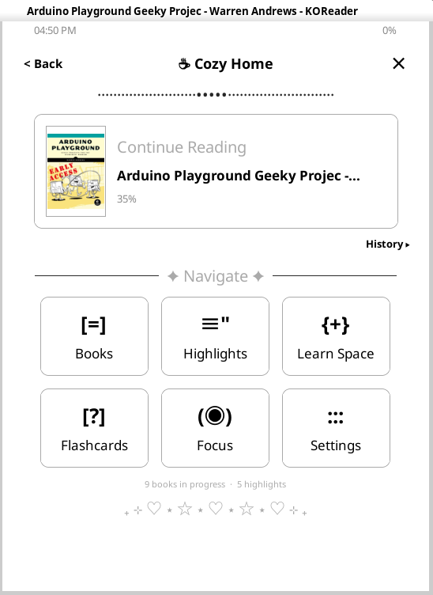
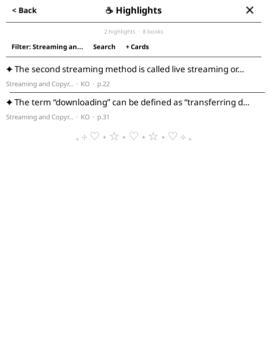
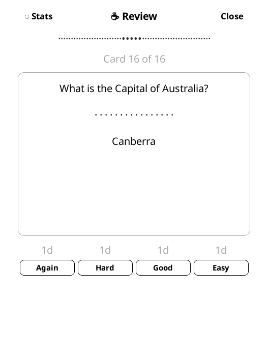
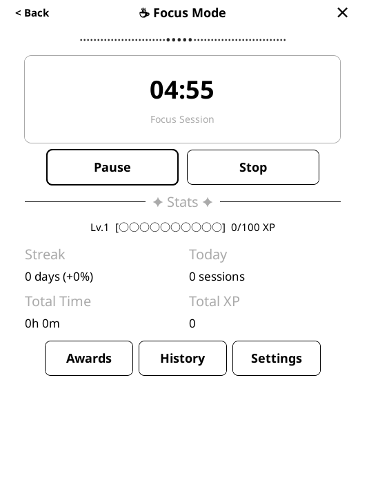
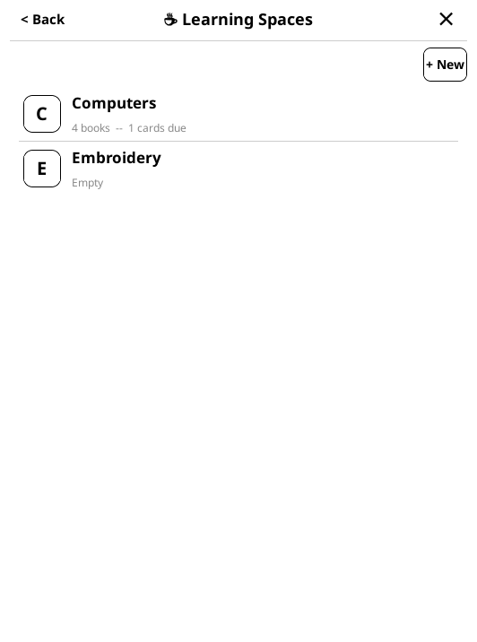

# ☕ Cozy Home: KOReader Homepage Plugin

A clean, customizable welcome screen that replaces KOReader's default file
browser. Big tappable tiles, minimal clutter, and quick access to your books,
highlights, flashcards, and study tools.

**Author:** Kimberley Gonzalez ([@thekimberleyann](https://github.com/thekimberleyann))  
**Version:** 0.12.2  
**License:** MIT  
**Devices Tested on:** Kobo Clara 2E (grayscale), Kobo Libra Colour  
**Updated:** February 18, 2026

---

## Screenshots

| Home | Highlights | Review |
|:----:|:----------:|:------:|
|  |  |  |

| Focus | Learn Space |
|:-----:|:-----------:|
|  |  |

---

## Features

### Welcome Dashboard
- Full-screen home screen with status bar (time + battery)
- Continue Reading card — last book, author, progress, one-tap resume
- 3×2 grid of navigation tiles (customizable order and visibility)
- Stats bar with reading activity summary
- Books tile opens KOReader's native file browser

### Highlights Browser
- Browse highlights for the current book or all books on device
- Filter by chapter, search across highlight text
- Tap a highlight → jump to source location in the book
- Create flashcards directly from highlights

### Learning Spaces
- Create named classes/topics (e.g. "Spanish", "LeetCode")
- Add book shortcuts to a class
- Three-tab detail view: Books, Notecards, Highlights
- Notecards tab auto-populates from class books' flashcards
- Link extra flashcards to a class with the card linker
- Highlights tab shows all highlights from class books
- Per-class quick resume (last book + position)

### Notecards Hub
- Two-tab interface: Stacks (deck tiles) and All Cards (flat list)
- **Self-contained review engine** — review flashcards directly from Cozy Home with no external plugin required
- Full SM-2 spaced repetition algorithm (Again / Hard / Good / Easy ratings)
- Interval previews on rating buttons, session stats, and completion summary
- Create, browse, filter, suspend, and delete cards
- Deck management: create, rename, delete decks; move cards between decks
- Filter cards by deck or by book
- Multi-select decks for combined review sessions
- Anki export (.apkg) — export all cards, by book, or by deck
- Anki import (.apkg) — import decks from Anki exports
- Works standalone; also shares data with Cozy Flashcards if installed

### Focus Mode
- Pomodoro timer with configurable work/break durations
- XP and streak tracking

### Settings Hub
- Configure tile visibility and order
- Display and behavior preferences
- Spaced repetition tuning
- Focus timer configuration

---

## Installation

Copy the `cozyhome.koplugin` folder into your KOReader `plugins/` directory:

```
[Kobo drive]:\.adds\koreader\plugins\cozyhome.koplugin\
```

Restart KOReader. Cozy Home appears under **Tools → Cozy Home** in the menu.

---

## File Structure

```
cozyhome.koplugin/
├── main.lua              Plugin entry point, menus, actions
├── config.lua            Central configuration and constants
├── home.lua              Welcome dashboard screen
├── history.lua           Recent reads screen
├── highlights.lua        Highlights browser screen
├── highlight_bridge.lua  Flashcard creation from highlights
├── learningspace.lua     Learning spaces / topic organization
├── notecards.lua         Notecards hub (stacks, cards, built-in review)
├── focusmode.lua         Pomodoro focus timer
├── settings.lua          Settings hub screen
├── statusbar.lua         Top status bar widget
├── cozyui.lua            Design system helpers (compat copy)
├── _meta.lua             Plugin metadata for KOReader
├── lib/
│   ├── cozyui.lua        Cozy Design System shared helpers
│   ├── database.lua      SQLite database wrapper (cozyhome.db)
│   ├── bookscanner.lua   Device book/library scanner (used by Learning Space)
│   ├── highlights.lua    KOReader sidecar file reader
│   ├── kobo.lua          Kobo native SQLite database reader
│   ├── anki_export.lua   Export flashcards to .apkg format
│   └── anki_import.lua   Import flashcards from .apkg files
└── data/                 SQLite databases (created at runtime)
```

---

## Databases

Cozy Home uses two SQLite databases:

| Database | Purpose |
|----------|---------|
| `cozyhome.db` | Learning spaces, focus mode data, preferences |
| `cozy_flashcards.db` | Flashcards, decks, review history, daily stats |

The flashcard database is shared with Cozy Flashcards if both plugins are
installed. Cozy Home can create and manage it independently.

---

## Requirements

- KOReader (recent version with LuaJIT / Lua 5.1)
- Target devices: Kobo Clara 2E, Kobo Libra Colour
